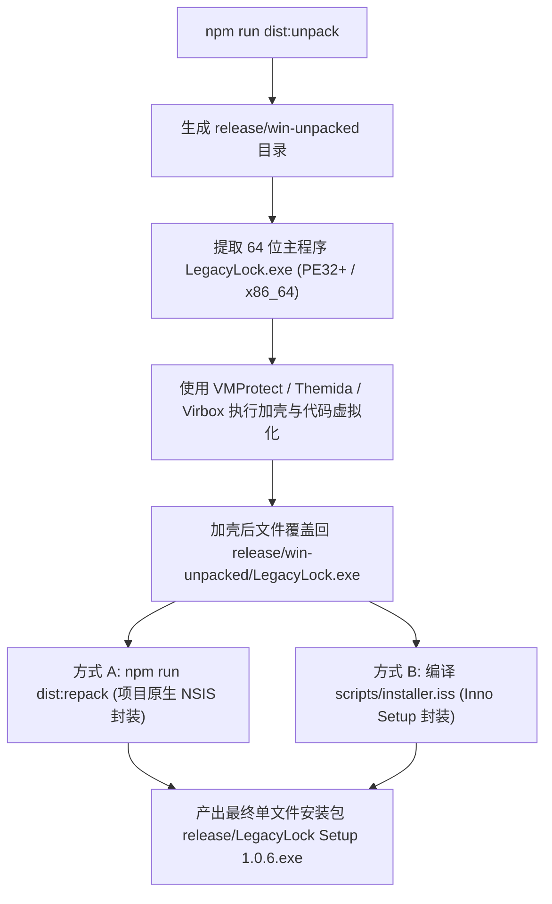

# 开发、加壳打包与灾备维护手册 · LVCF 3 (v1.0.6)

## 当前架构组件

- `electron/vault-core.cjs`：唯一的新协议实现；固定参数 scrypt、AES-256-GCM、Ed25519 签名、两份独立恢复秘密 (2-of-2 HKDF)、结构及容量验证、内存即时擦除 (fill(0))。
- `electron/vault-store.cjs`：串行写入队列、同目录临时文件、强制物理 fsync、原子替换 rename、上一快照快照备份 (.previous)、写入读回双重核验；所有者/继承人只读/锁定会话生命周期和自增锁定代次 (epoch)。
- `electron/vault-controller.cjs`：设备配置编排、异机恢复、导出导入、凭据轮换、彻底销毁；设备与对话框适配器支持故障注入与异常测试。
- `electron/vault-local-key.cjs`：基于操作系统底层安全存储 (Windows DPAPI / macOS Keychain / Linux Secret Service) 实现的本机安全密钥托管；具备信封特征绑定哈希 (SHA-256)，密码轮换自动物理失效。
- `electron/vault-media.cjs`：主进程枚举真实硬件 USB 设备，强制校验物理设备序列号，杜绝同一物理盘的不同分区充当双盘角色。
- `electron/main.cjs` / `preload.cjs`：隔离沙箱、上下文隔离 (Context Isolation)、可信主 Frame 来源校验、固定白名单 IPC 映射、外部网络请求全拦截、系统锁屏与休眠即时锁屏响应、单实例互斥锁。
- `src/services/vaultClient.ts`：类型化固定 IPC 调用与三语言错误提示，不读取旧浏览器存储。
- `electron/vault-preferences.cjs` / `vault-tray.cjs`：本机外观、语言、托盘、演示偏好与可注入测试的托盘生命周期。持久偏好修改必须是所有者；临时显示语言不持久化。
- `electron/ui-messages.json` / `src/services/messages.ts`：流程与原生对话框的中英日文案；原有类别等字典位于 `src/services/i18n/`。用户资产内容不参与翻译。
- `src/App.tsx`：界面主入口；按需加载资产列表、编辑器、类别选择与订阅体验页。
- `scripts/recovery-reader.cjs`：使用相同协议代码的独立、零外部依赖只读离线恢复脚本。
- `scripts/installer.iss`：企业级 Inno Setup 单文件安装包二次打包脚本。

桌面不再调用 Rust、启动 HTTP 服务、通过 PATH 发现密码工具，或使用浏览器 localStorage/IndexedDB 保存新密库与密钥。关闭窗口弹出原生选择：锁定并隐藏至托盘、退出、取消。退出会锁定并等待当前写入队列结束。重复启动通过 Electron 主进程单实例锁恢复已有窗口。已经完成替换但无法确认读回的异常会强制锁定，避免继续基于旧内存覆盖磁盘。

---

## 本地开发与测试流程

使用 Node.js 24 LTS：
```sh
npm ci
npm test
npm run build
npm run test:desktop
```

* `npm test`：运行全量密码学、会话、双盘配对、本地密钥安全存储、备份恢复等 36 项核心回归测试。
* `npm run test:desktop`：启动独立的无头 Electron 桌面冒烟测试，使用独立临时用户目录、合成资产和模拟设备文件夹；不接触真实用户密库或物理 USB。测试截图存放在审计目录中。Linux 桌面测试需显示服务（例如 `xvfb-run --auto-servernum node tests/run-desktop.cjs`）。
* `npm run electron`：加载构建产物 `dist/`，因此改动前端界面后应先执行 `npm run build`。浏览器 `npm run dev` 仅提供开发界面预览，不具备后端密库能力。

---

## 商业打包与安全加壳流水线 (Commercial Shelling & Repackaging)

为了兼顾源代码反逆向保护与安装分发的便携性，项目规范了工业级的“解包 -> 加壳 64 位原生程序 -> 二次重封包”流水线：



### 1. 生成 64 位原生解包目录
```powershell
npm run dist:unpack
```
该指令会先编译前端，再通过 `electron-builder --win --dir` 生成 `release/win-unpacked/`。
真正运行业务宿主的 64 位主程序为：
👉 `release\win-unpacked\LegacyLock.exe`

### 2. 商业加壳保护（VMProtect / Themida / Virbox）
* **加壳输入**：`release\win-unpacked\LegacyLock.exe`
* **架构选择**：`64-bit (x64 / AMD64)`
* **加壳重点**：保护入口点、开启反调试与内存防转储。
* **兼容约束**：务必保留 `.rsrc` 资源段（不得压缩混淆资源），以防止 Electron 应用图标与 PE 版本元数据损坏。
* **加壳产物**：将保护后的 EXE 覆盖替换回 `release\win-unpacked\LegacyLock.exe`。

### 3. 一键重封包为商业安装程序
* **原生 NSIS 重封包**：
  ```powershell
  npm run dist:repack
  ```
  直接将包含加壳主程序的 `release/win-unpacked` 封装为单文件安装程序 `release\LegacyLock Setup 1.0.6.exe`（无需重新编译）。
* **Inno Setup 脚本封装**：
  使用 Inno Setup 编译器打开并编译 [`scripts/installer.iss`](file:///c:/XMWJJ/xr-LegacyLock/scripts/installer.iss)，生成体积更小、更紧凑的商业安装包。

---

## 数据物理位置与文件结构

* **本机密库位置**：位于 Electron `app.getPath('userData')` 下的 `vault-v3.llvault`；上一份已保存的加密快照为 `.previous` 后缀。
  * Windows: `%APPDATA%/legacylock/vault-v3.llvault`
  * Linux: `~/.config/legacylock/vault-v3.llvault`
  * macOS: `~/Library/Application Support/legacylock/vault-v3.llvault`
* **本地记住密钥凭据**：位于 `app.getPath('userData')/local-key-v1.json`，仅保存系统加密密文和哈希绑定，绝不同步或备份。
* **物理主盘位置**：`LegacyLock/<id>/<generation>/vault.llvault` 及 `primary.llkey`。
* **物理副盘位置**：`LegacyLock/<id>/<generation>/secondary.llkey`（副盘为纯凭证盘，不存数据副本）。

---

## 灾难恢复与文件损坏处理规范

读取或签名校验失败时，应用会主动呈现损坏状态，严禁自动清空或覆盖原盘数据。

1. **第一步（原件保全）**：立即退出应用，完整复制当前原 `userData` 目录和 U 盘物理文件到安全隔离目录中保全。
2. **第二步（多因子验证）**：在干净测试环境或备用电脑上，使用双盘或已知所有者凭据验证备份文件的可读性，核对资产数量与版本号。
3. **第三步（快照抢救）**：若当前文件被破坏，可核验 `.previous` 文件（可能少一次最近保存，需使用对应代次的口令与密钥验证）。
4. **第四步（离线阅读器抢救）**：在无桌面环境或异机应急时，使用：
   ```sh
   node scripts/recovery-reader.cjs <vault.llvault> <primary.llkey> <secondary.llkey> <output.json>
   ```
   离线阅读器仅要求双盘合璧，输出明文备份 JSON，绝不修改原密库。

---

## 长期维护与安全红线

* **格式与兼容性**：任何密库协议变更必须增加格式版本号，严禁对旧版本做无通知的隐式静默转换。
* **安全底线**：严禁引入明文降级存储、固定随机数种子、伪签名或通过前端 UI 绕过后端鉴权的管理员开关。
* **真实硬件实测**：自动化适配器与软件测试不能代替物理 USB 盘符掉盘、意外断电、写保护等极端硬件场景的实机验证。
